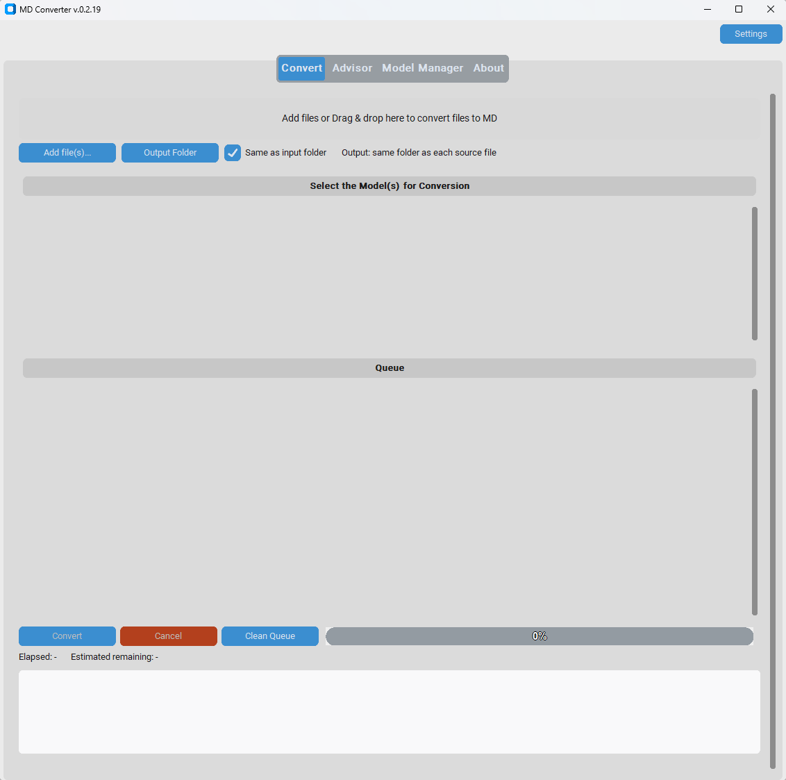
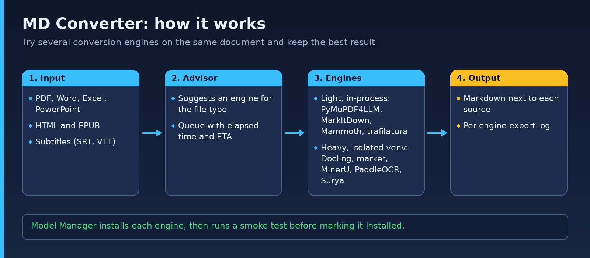

# MD Converter

**A Windows desktop app that converts PDF, HTML, Word, PowerPoint, Excel, EPUB and subtitle files to Markdown, with a choice of locally run conversion engines. No cloud APIs, no telemetry.**

[](LICENSE)  [](https://github.com/junqueirach/md-converter/actions/workflows/ci.yml)

<p align="center"></p>

**Download for Windows:** get `MD-Converter-0.2.21-win64.zip` from the [latest release](https://github.com/junqueirach/md-converter/releases/latest) (about 135 MB). Unzip it, open the `MD Converter` folder and double-click `MD Converter.exe`. No Python needed. The SHA-256 checksum is in the release notes.

> **Windows SmartScreen and antivirus:** the file is not code-signed, so Windows may show "Windows protected your PC". Click **More info**, then **Run anyway**. Antivirus software may also analyse a new unsigned program on its first start, which can make the window hang. If that happens, close it and start it again. You can also run the app from source (see Quick start) and read every line of the code first.

## Why it exists

Good RAG answers start with good source text. PDFs are the hard part: layouts, tables, scans. No single converter wins on every document, so this app lets you try several and compare. Everything runs on your own computer, which matters when the documents are confidential.

## How it works

<p align="center"></p>

## Highlights

- **Light engines** (in-process): PyMuPDF4LLM, trafilatura, MarkItDown, Mammoth, markdownify, pysrt, webvtt-py, pytesseract, pypandoc
- **Heavy engines** (each in its own isolated virtual environment): Docling, Unstructured, marker, MinerU, PaddleOCR, Surya
- **Model Manager**: installs each engine, then runs a smoke test before marking it "Installed" (a successful `pip install` is not treated as proof)
- **Advisor** that suggests an engine for the file type
- **Self-installing**: first launch sets up its own dependencies; can install a private Python 3.12 without admin rights
- **Pinned versions** so a working install does not break later
- **Export Log** button per engine, because complete logs made troubleshooting much faster
- Handles Windows-specific traps: PyTorch without a C++ compiler, PaddlePaddle oneDNN crashes, Tesseract elevation

## Quick start

```
pip install -r requirements.txt
python md_converter.py
```

Requires Python 3.11+ on Windows. The full manual is in [docs/USER-GUIDE.md](docs/USER-GUIDE.md) (supported formats, Base Folder layout, timeouts, building the `.exe`, troubleshooting, known issues). See [docs/legacy-README.md](docs/legacy-README.md) for older technical notes on install problems found on real machines.

## Project facts

- Version 0.2.21, about 5,500 lines of Python, single file with clearly marked sections (registry, advisor, installer, env manager, settings, runners, GUI)
- About 50 numbered versions in `archive/versions/`

---

## How this was built

Built with **Claude (Anthropic)** as the coding partner. I wrote the requirements and the revision prompts, tested every build on real data, and decided what to fix next. The `archive/versions/` folder keeps every earlier release so the iteration history is visible.

**Security note:** the app stores any API keys you enter in a local settings file outside this repository. `.gitignore` excludes config and settings files so keys are never committed.

## Contributing and security

See [CONTRIBUTING.md](CONTRIBUTING.md) and [SECURITY.md](SECURITY.md). Bug reports and ideas are welcome through the issue templates.

## Licence

MIT for the app's own code. See [LICENSE](LICENSE). The Windows `.exe` bundles PyMuPDF / PyMuPDF4LLM (AGPL-3.0) and pysrt (GPL-3.0); details in the [user guide](docs/USER-GUIDE.md#licensing-note).

## Author

Luiz Junqueira - [junqueira.ch](https://www.junqueira.ch) - [LinkedIn](https://www.linkedin.com/in/luizjunqueira/)
